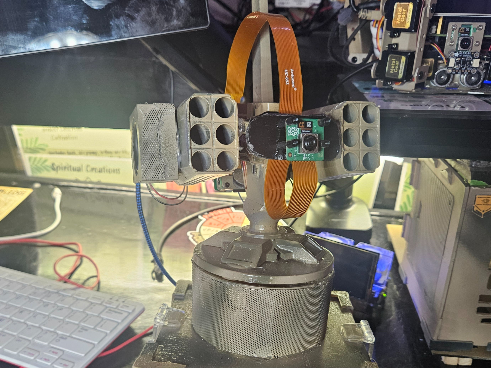
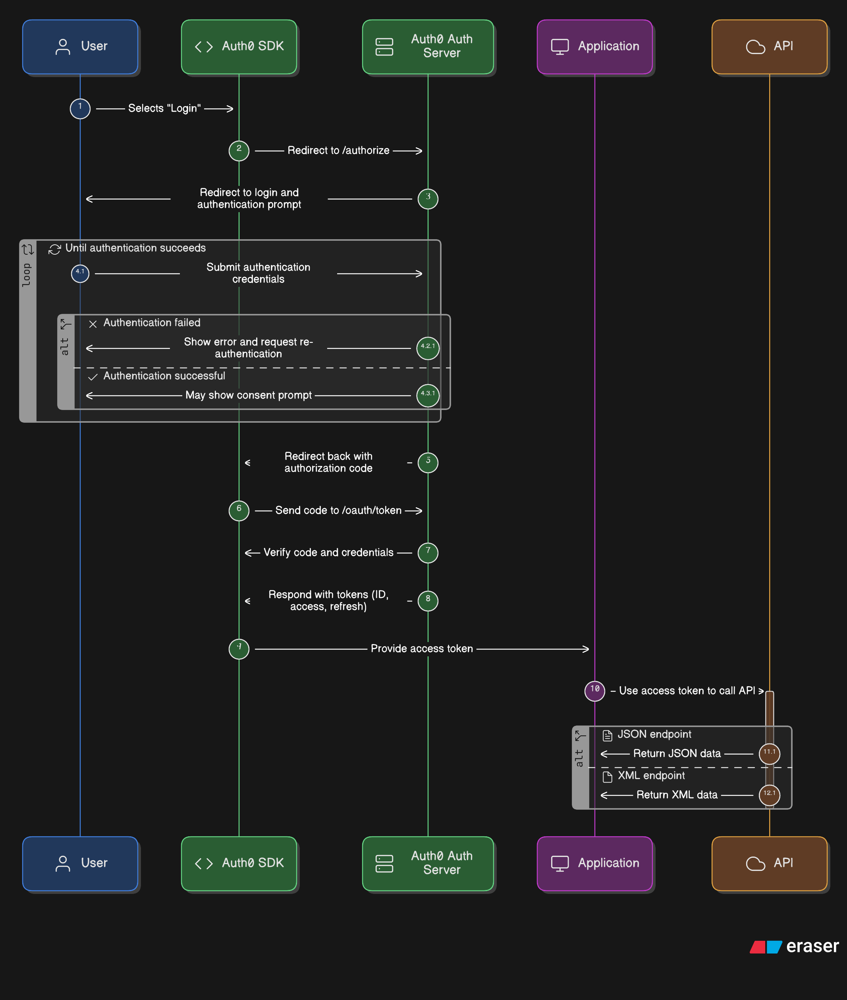
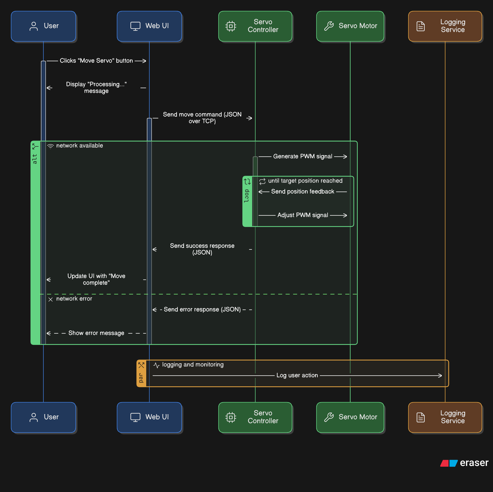

# Aurora Camera System – Pi Zero 2 W + Pico 2 W Servo Controller


This project connects a **Raspberry Pi Zero 2 W** running a web UI to a **Raspberry Pi Pico 2 W** that drives pan/tilt servos.  
The Pi Zero serves a control dashboard, and the Pico listens for commands over Wi-Fi.


---

## 🛠 Hardware

- Raspberry Pi Zero 2 W (web UI host, camera controller)
- Raspberry Pi Pico 2 W (RP2350) (servo controller)
- Pan/Tilt servos (controlled by Pico)
- OLED/TFT display (for status output)
- Shared Wi-Fi network

---

## ⚙️ Setup

### 1. Flash firmware to Pico 2 W

1. Hold **BOOTSEL** while plugging the Pico 2 W into USB.
2. It mounts as a drive named `RP2350`.
3. Download and copy the latest MicroPython firmware for Pico 2 W:  
   👉 [pico2-w-20240602.uf2](https://micropython.org/resources/firmware/pico2-w-20240602.uf2)
4. The board reboots into MicroPython.

### 2. Install MicroPython libraries

Upload any required libraries to the Pico (e.g. for display/servo control).  
Thonny → **Tools → Manage Packages** → install as needed.

### Pico 2 W Dependencies

- `network` (built-in MicroPython Wi-Fi)
- `socket` (built-in)
- `machine` (built-in, for Pin, PWM, SPI)
- `_thread` (built-in, multithreading support)
- `ssd1306.py` (if using OLED display)
- `st7789.py` (if using TFT display)

## 📦 Dependencies

### Pi Zero 2 W (Web UI host)

Install Python packages with pip:

```bash
pip install -r requirements.txt


### 3. Upload firmware scripts
- Copy `main.py` (the fixed Pico code) to the Pico as **`main.py`**  
- Copy `camera_server.py` (the Pi Zero web UI code) onto the Pi Zero 2 W.

---

## 🚀 Running
1. Boot the **Pi Zero 2 W** – it hosts a web UI.
2. Boot the **Pico 2 W** – it connects to Wi-Fi and starts listening.
3. From your PC, open the Pi Zero’s web UI.
4. Use the buttons to send servo commands – the Pico executes them instantly.

---

## 🔧 Debugging Notes
- If Thonny shows only `MPY: soft reboot` and hangs → that’s normal when `main.py` runs an infinite loop.  
  - Use **Shift + Stop/Restart** in Thonny to break into REPL without running `main.py`.  
  - Or BOOTSEL → delete/replace `main.py` if it’s bad.  
- The Pico prints a **heartbeat** every ~100s:  

## 🔄 System Architecture


Data flow:
- **PC (Web Browser)** → HTTP requests → **Pi Zero 2 W (Web UI)**
- **Pi Zero 2 W** → JSON/TCP → **Pico 2 W (Servo Controller)**
- **Pico 2 W** → PWM signals → **Servos**

## 📡 Command Flow (Sequence)

```mermaid
sequenceDiagram
    participant User as User (Web Browser)
    participant PiZero as Pi Zero 2 W (Web UI)
    participant Pico as Pico 2 W (Servo Controller)
    participant Servo as Servos

    User->>PiZero: Click button in web UI
    PiZero->>Pico: Send JSON command over TCP
    Pico-->>PiZero: JSON response (status)
    Pico->>Servo: PWM signal to move
    Servo-->>Pico: New position feedback (pan/tilt)
    PiZero-->>User: Update status in web UI
## 🔌 Startup Sequence

```mermaid
sequenceDiagram 
    participant Pico as Pico 2 W (Servo Controller)
    participant WiFi as Wi-Fi Network
    participant PiZero as Pi Zero 2 W (Web UI)
    participant User as User (Web Browser)

    Pico->>WiFi: Connect to Wi-Fi (DHCP)
    WiFi-->>Pico: IP address assigned
    Pico->>Pico: Start heartbeat + listener (TCP port 8888)
    PiZero->>WiFi: Connect to same network
    PiZero->>Pico: Test status request (JSON/TCP)
    Pico-->>PiZero: Send status (pan/tilt)
    User->>PiZero: Open web UI
    PiZero-->>User: Dashboard ready


## 📜 License

This project is licensed under the terms of the [MIT License](LICENSE)

